[//]: # (For future development: The images in the tutorial were taken from a terminal window with 135 columns and 35 lines. The blue arrows are #4EC8FB. Use pngcrush to minimize image size.)

# Zulip Terminal User Tutorial

Hi, are you new to [Zulip](https://github.com/zulip/zulip)? If so, we recommend trying out our [web-client](https://chat.zulip.org) first to understand the concept of [streams and topics](https://zulip.com/help/about-streams-and-topics) in the world of Zulip. Please read through our [community docs](https://zulip.readthedocs.io/en/latest/contributing/chat-zulip-org.html) to get a feel for how things work. Just sending a message or two in the [#test here](https://chat.zulip.org/#narrow/stream/7-test-here) stream should help you get started. If you don't already have a Zulip account, you'll also have to use our [web-client](https://chat.zulip.org) to sign up because currently you can't create an account using Zulip Terminal.

Now let's help you get started with using Zulip Terminal. First, if you haven't already, go ahead and complete the [installation](https://github.com/zulip/zulip-terminal#installation). If you encountered any issues, we have common issues and their solutions listed [here](https://github.com/zulip/zulip-terminal/blob/main/docs/FAQ.md) if you run into trouble. Feel free to ask questions or for help at [#zulip-terminal](https://chat.zulip.org/#narrow/stream/206-zulip-terminal) or support@zulip.com.

> **Note that the screenshots below may look slightly different in recent versions, but behavior should be very similar.**

## Overview

This tutorial was designed to be interactive. We highly recommend opening up Zulip Terminal and following along! We'll try out a few keyboard shortcuts and send a couple of messages to help familiarize ourselves with Zulip Terminal. Here's an overview of the features we'll be walking you through:

0. [Open Zulip Terminal](#Open-Zulip-Terminal)
1. [Understand the Layout](#Understand-the-Layout)
2. [Your Cursor](#Your-Cursor)
3. [Keyboard Shortcuts](#Keyboard-Shortcuts)
4. [Narrowing](#Narrowing)
    + [Your Current Narrow](#Your-Current-Narrow)
    + [Narrow to a Stream](#Narrow-to-a-Stream)
    + [Narrow to a Topic](#Narrow-to-a-Topic)
5. [Reading Messages](#Reading-Messages)
    + [Narrow to the Stream or Topic of a Message](#Narrow-to-the-Stream-or-Topic-of-a-Message)
6. [Sending Messages](#Sending-Messages)
    + [Reply to a Message](#Reply-to-a-Message)
    + [Reply via a Direct Message](#Reply-via-a-Direct-Message)
    + [Send a Direct Message to Someone New](#Send-a-Direct-Message-to-Someone-New)
    + [Create a New Topic](#Create-a-New-Topic)
7. [Edit a Message](#Edit-a-Message)
8. [Close Zulip Terminal](#Close-Zulip-Terminal)

*Note: You can always use <kbd>?</kbd> to open **help** and view keyboard shortcuts.*

## Open Zulip Terminal

Once you have [installed](https://github.com/zulip/zulip-terminal#installation) the app, use the `zulip-term` command to run it within your terminal. You will be prompted to add the URL of the organization you're a part of—use chat.zulip.org to join the Zulip community server—and log into your account. If you don't already have a Zulip account, you'll have to use our web-client to sign up because currently you can't create an account using Zulip Terminal. Learn more about how to [sign up for an account](https://zulip.com/help/join-a-zulip-organization). If you're looking to join the Zulip community server you can do so [here](https://chat.zulip.org).

If you have issues opening Zulip Terminal, check out our [Running for the First Time](https://github.com/zulip/zulip-terminal#running-for-the-first-time) section.

*Note: This tutorial assumes you're on the Zulip Community Server. While you can still follow along if you're not, various examples won't be the same (such as the [#test here](https://chat.zulip.org/#narrow/stream/7-test-here) stream).*

## Understand the Layout
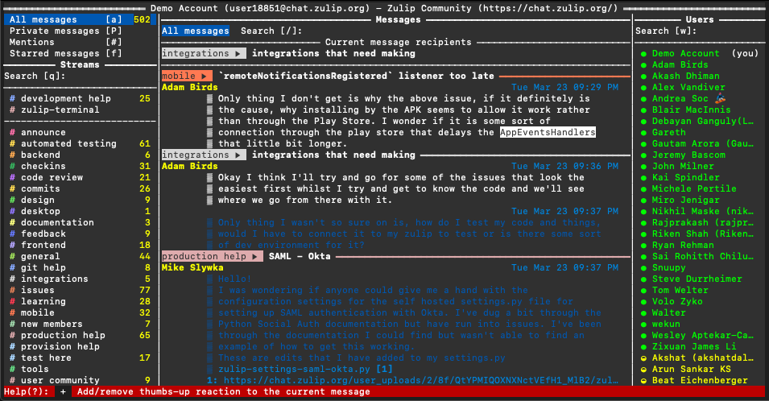

Zulip Terminal is divided into three columns/divisions:
+ **The left column** shows list of all the streams you are subscribed to and some keyboard shortcuts for viewing different types of messages.
+ **The middle column** displays all the messages in the current narrow.
+ **The right column** shows all the active(green)/idle(yellow)/offline(white) users.

## Your Cursor

When you first open Zulip Terminal, your cursor will be located in the upper left-hand corner on **All Messages**. You can tell because the section will be highlighted (see image below). You can use your cursor to navigate around Zulip Terminal - let's try moving the cursor around and see what happens. Try moving it left (<kbd>left</kbd>/<kbd>h</kbd>), right (<kbd>right</kbd>/<kbd>l</kbd>), up (<kbd>Up</kbd>/<kbd>k</kbd>) and down (<kbd>Down</kbd>/<kbd>j</kbd>).

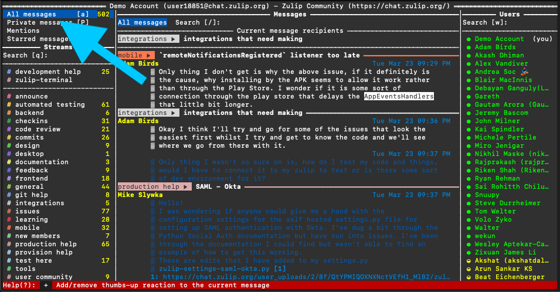

## Keyboard Shortcuts

Sometimes it can take forever to manually move our cursor where we want it - that's why Zulip Terminal has keyboard shortcuts! Type <kbd>?</kbd> to open **help** and view a list of keyboard shortcuts. You can also view a list of [keyboard shortcuts here.](https://github.com/zulip/zulip-terminal/blob/main/docs/hotkeys.md)

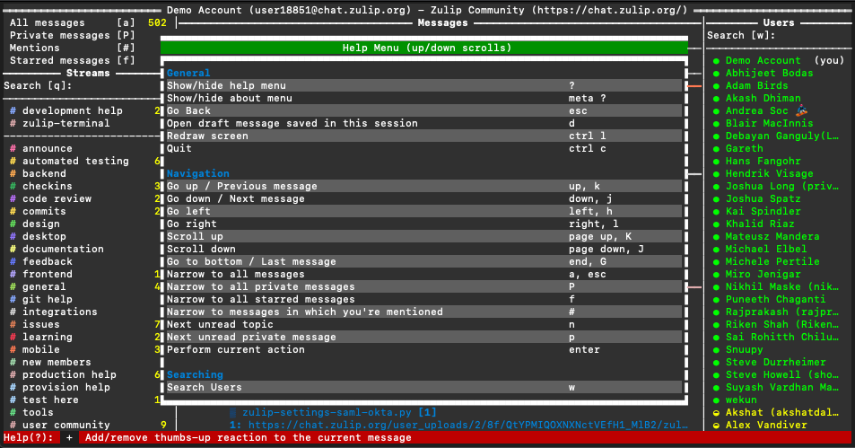

Let's try out a few of these shortcuts!

+ First, type <kbd>shift</kbd><kbd>p</kbd> to view your **Direct Messages**.

+ Second, type <kbd>#</kbd> to view all messages you were mentioned (@'ed) in.

+ Third, type <kbd>/</kbd> to jump to the search bar at the top of the screen in the middle column. Type <kbd>esc</kbd> to move your cursor out of the search box so we can use our keyboard shortcuts again (otherwise you'd just be typing them in the search box!).

<kbd>esc</kbd> is one of the most important shortcuts and is used for much more than exiting the search box—it's essentially the 'go back' button. If you're ever somewhere and you can't seem to get out, type <kbd>esc</kbd>.

## Narrowing

You'll be hearing the term 'narrow' a lot in Zulip. What does it mean?

+ **Noun**: A narrow is a set of filters for Zulip messages, that can be based on many different factors (like sender, stream, topic, search keywords, etc.).
+ **Verb**: The process of navigating to a different narrow. For example, to go from viewing a stream to a topic within that stream. There are several different ways to 'narrow to a narrow' so to speak. For example, you can use the keyboard shortcuts as we did in the section above. When you used the keyboard shortcut <kbd>shift</kbd><kbd>p</kbd> to view your direct messages, you 'narrowed' to the **Direct Messages** narrow.

### Your Current Narrow

Your current narrow is displayed at the top of Zulip Terminal in the middle column. The current narrow in the image below is **Starred messages**. If you ever get lost, just look here.

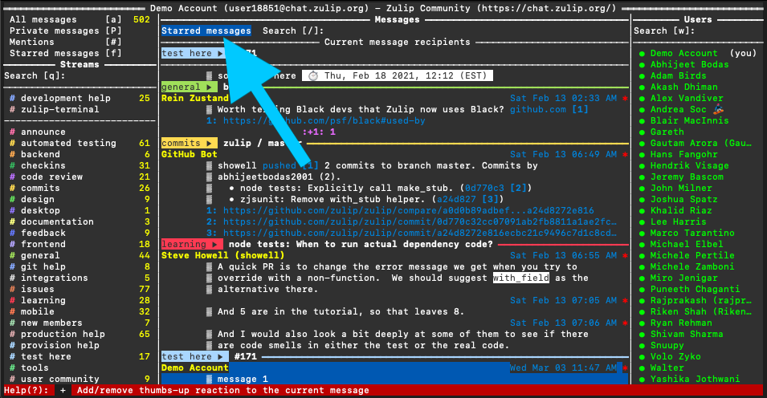

### Narrow to a Stream
To 'narrow to a stream' means to set the middle column to only show messages present in that stream. Let's try narrowing to the **[#test here](https://chat.zulip.org/#narrow/stream/7-test-here)** stream. [Move your cursor](#Your-Cursor) to the left column of Zulip Terminal and then move your cursor down (<kbd>Down</kbd>/<kbd>j</kbd>) until it rests on "#test here". Press <kbd>Enter</kbd> to narrow to the stream.

Check out the top of the middle column, your current narrow should now be "test here" like in the image below.

*Note: The colors in your terminal may vary from the ones in the screenshot.*

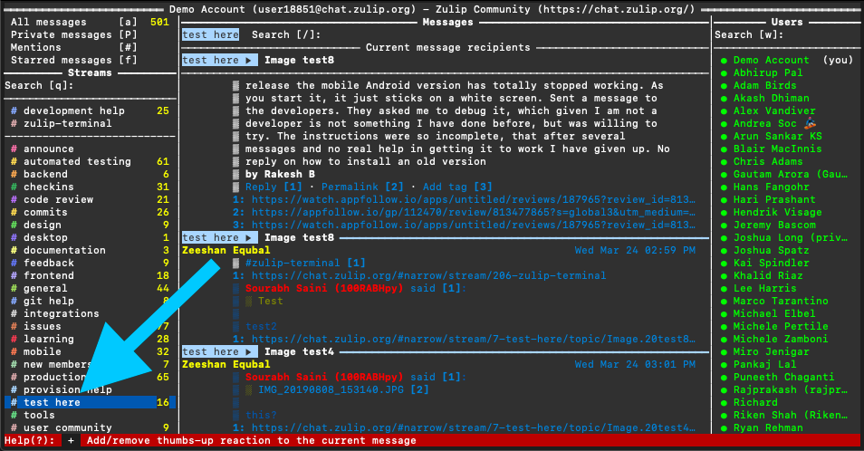

### Narrow to a Topic

First, let's move our cursor back to the **[#test here](https://chat.zulip.org/#narrow/stream/7-test-here)** stream in the left column - otherwise the following keyboard shortcut won't work. With our cursor on the **[#test here](https://chat.zulip.org/#narrow/stream/7-test-here)** stream, type <kbd>t</kbd> to toggle on a list of topics within that stream. Move your cursor to a random topic and then press <kbd>Enter</kbd> to narrow to that topic. You've successfully narrowed to a topic! Notice how at the top of the middle column your current narrow is displayed as **test here ► topic you chose**.

To toggle off the topic list and go back to viewing the stream list, move your cursor back to the list of topics in the left column and type <kbd>t</kbd> again.

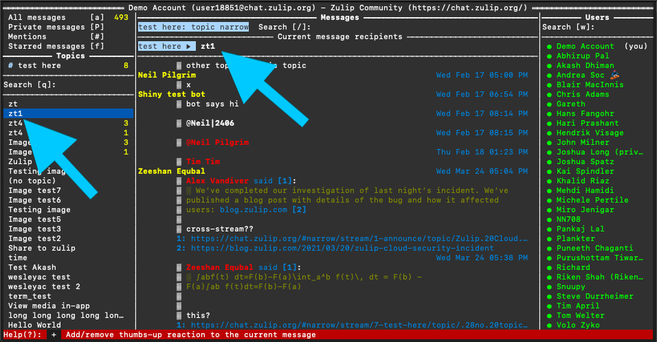

## Reading Messages

Time to read some messages! Read messages by scrolling up (<kbd>Up</kbd>/<kbd>k</kbd>) and down (<kbd>Down</kbd>/<kbd>j</kbd>). Any message that your cursor selects will be marked as read. If a message was visible, but never selected, it will not be marked as read. Messages marked as 'read' are colored white and unread messages are blue - notice how in the image below all of the messages below my cursor are blue and all the ones above it are white. Notice also how the number of unread messages in your current narrow decreases as you scroll through them. Learn more about when messages are marked as read [here](https://github.com/zulip/zulip-terminal/blob/main/docs/FAQ.md#when-are-messages-marked-as-having-been-read).

When you enter a new narrow, Zulip Terminal normally will automatically place your cursor on the oldest unread message in that narrow.

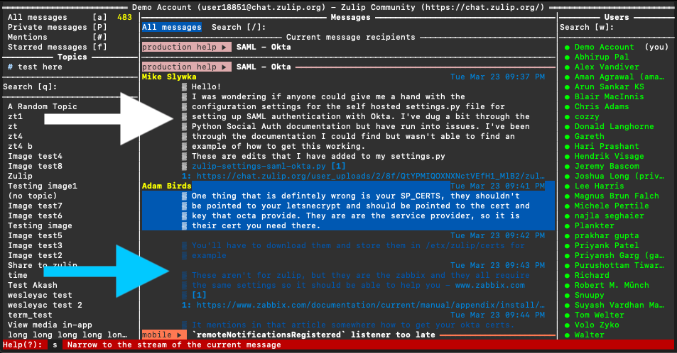

### Narrow to the Stream or Topic of a Message

Now that we know how to read through messages, let's try filtering to see only messages related to the one we currently have selected. To see this in action you'll want to head back to **All Messages** (<kbd>a</kbd>) before each bullet point. 

+ Type <kbd>s</kbd> to narrow to the stream of the current message.

+ Type <kbd>shift</kbd><kbd>s</kbd> to narrow to the topic of the current message. *Note that this works even if you weren't already in the topic's stream.*

You can also type <kbd>z</kbd> to 'zoom in' or 'zoom out.' What do I mean by 'zoom in/out?' Essentially if you're currently in a topic narrow, <kbd>z</kbd> will place you in the selected message's stream, but if you're in a stream <kbd>z</kbd> will place you in the selected message's topic. Try it and see for yourself, press <kbd>z</kbd> a few times and check out your [current narrow](#Your-Current-Narrow).

## Sending Messages

### Reply to a Message

To reply to an existing stream- or direct-message in any narrow, rest your cursor on the message you want to reply to and then type <kbd>r</kbd>. Type your message in the Message box that pops up at the bottom of the middle column. Type <kbd>ctrl</kbd><kbd>d</kbd> to send. If you change your mind and don't want to send the message, type <kbd>esc</kbd> to get out of the message editor. Let's try replying to a random message in the **[#test here](https://chat.zulip.org/#narrow/stream/7-test-here)** stream (don't worry about messing anything up, the [#test here](https://chat.zulip.org/#narrow/stream/7-test-here) stream was made for stuff like this).

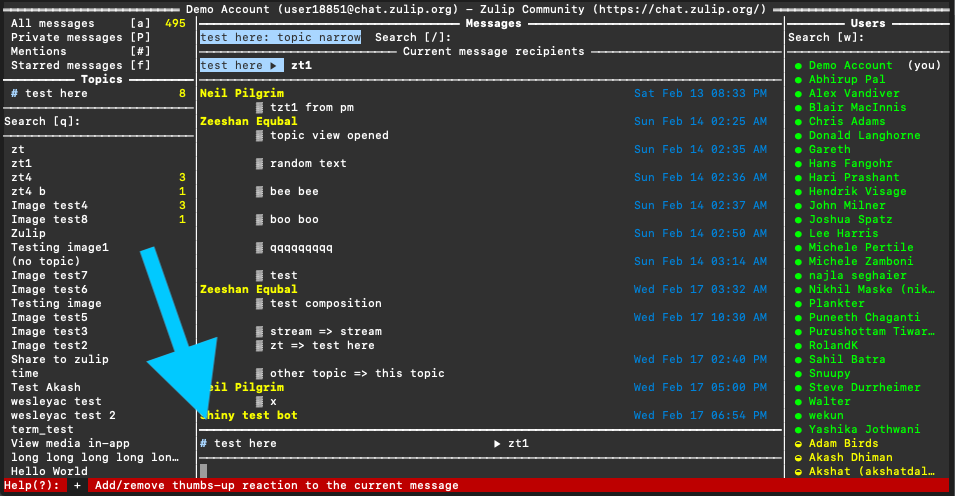

#### Thumbs-up Reaction

If you want to show you agree with the current message, type <kbd>+</kbd> to add a thumbs-up reaction. Type <kbd>+</kbd> again to remove the thumbs-up.

### Reply via a Direct Message

Let's try sending a direct message to the author of a message. Select the message you sent to the [#test here](https://chat.zulip.org/#narrow/stream/7-test-here) stream earlier and press <kbd>shift</kbd><kbd>r</kbd> to send a direct message to yourself. Type your message in the message editor that appears at the bottom of the middle column and then type <kbd>ctrl</kbd><kbd>d</kbd> to send. Press the <kbd>shift</kbd><kbd>p</kbd> hotkey as we did earlier in the tutorial to narrow to your direct messages and make sure everything worked properly.

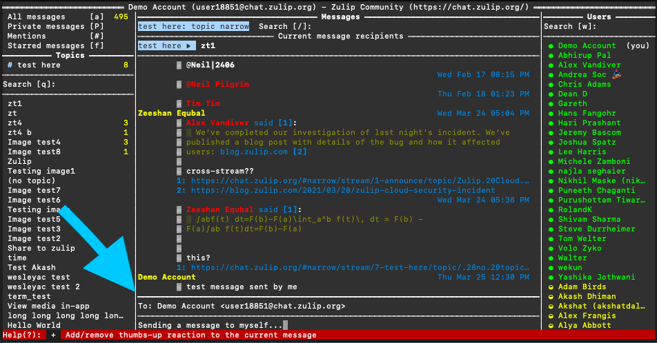

### Send a Direct Message to Someone New

You can send a direct message by moving your cursor to the list of "Users" in the right column and selecting the name of the person you'd like to send a message to.

From version 0.7.0 you can also use autocomplete to enter people's names from partial information, and easily send one-to-one or group direct messages!

To send a direct message using the autocomplete feature:
1. Use the <kbd>x</kbd> hotkey. A message editor will pop open at the bottom of the middle column. 
2. Type in part of the name of the person you'd like to send a direct message to (IMG 1)
3. Press <kbd>ctrl</kbd><kbd>f</kbd> and a list of potential recipients will appear in the footer (highlighted in red). 
4. Press <kbd>ctrl</kbd><kbd>f</kbd> until the name of the person you want to send a message to is highlighted (IMG 2). 
5. Press <kbd>tab</kbd> to jump to the message section and type in your message. 
6. Press <kbd>ctrl</kbd><kbd>d</kbd> to send.
7. Press <kbd>esc</kbd> to get out of the message editor.

Try following the steps above to send a message to the Welcome Bot!

> It's best to use <kbd>ctrl</kbd><kbd>f</kbd> to autocomplete the name and Zulip address of the person (or bot) you want to message; if you just type in their full name, Zulip Terminal does not know for sure who you are trying to send to - and there may be multiple people with that name!

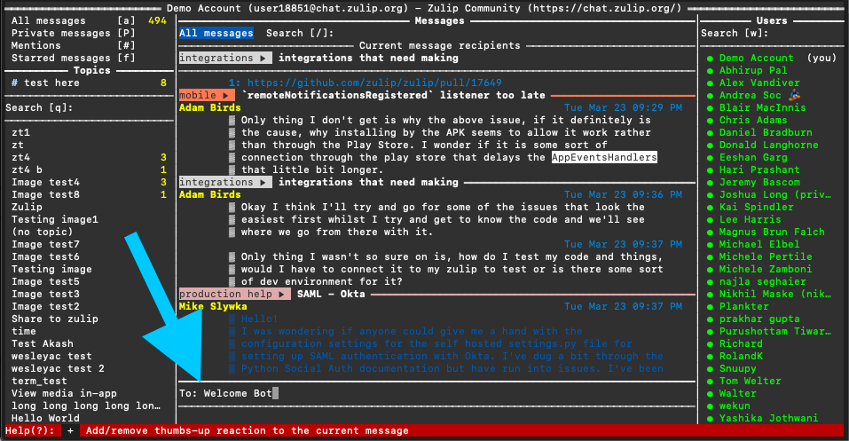
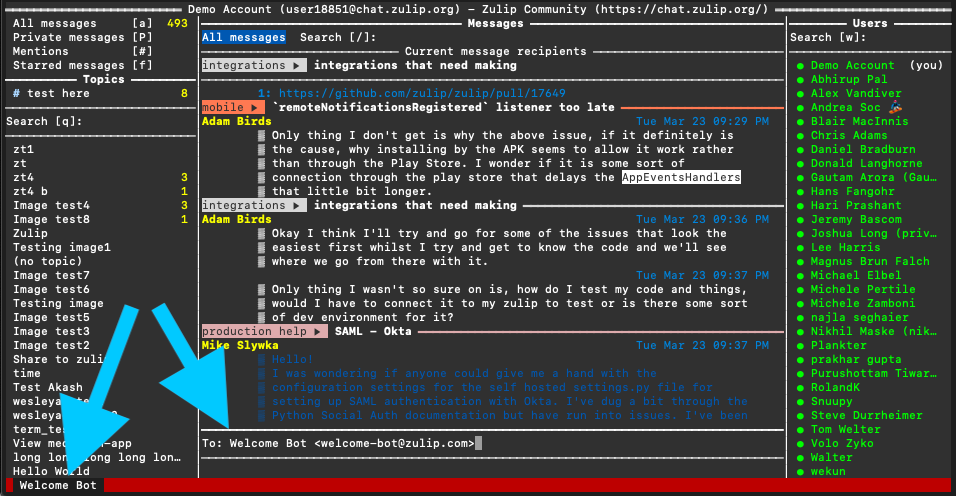

### Create a New Topic

To create a new topic in a stream, type <kbd>c</kbd> and a message editor will pop open at the bottom of the middle column. Make sure your cursor is in the middle column, otherwise nothing will happen when you type <kbd>c</kbd>.

By default this will send a new message to the stream of whichever message you have selected. Let's send a test message to **[#test here](https://chat.zulip.org/#narrow/stream/7-test-here)**. If you're not already in the **[#test here](https://chat.zulip.org/#narrow/stream/7-test-here)** stream, replace the stream name with 'test here'. Use <kbd>tab</kbd> to jump to the topic section and type in a topic. Type <kbd>tab</kbd> again to jump to the message section and type in a message. Type <kbd>ctrl</kbd><kbd>d</kbd> to send. If you're following along, feel free to actually send the message, [#test here](https://chat.zulip.org/#narrow/stream/7-test-here) is for things like this tutorial.

Type <kbd>esc</kbd> to get out of the message editor.

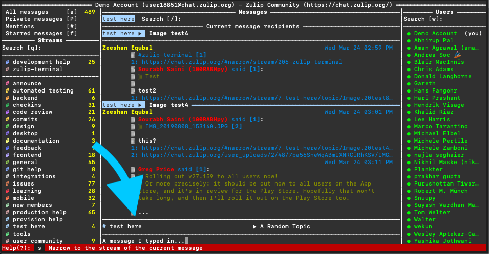

## Edit a Message

Let's try editing the new topic we added to the **[#test here](https://chat.zulip.org/#narrow/stream/7-test-here)** stream. By default, Zulip allows you to edit the content of your messages within 10 minutes of when you send them, but some servers allow you to edit messages for longer. You can edit message content for up to one hour after sending on the Zulip Community server.

To edit a message, first make sure your cursor is resting on the message you want to edit then type <kbd>e</kbd>. You can edit the message's content or topic, but not the stream. By default your cursor will be in the content portion of the message, press <kbd>tab</kbd> to move it to the stream or topic portion if you'd like to edit those as well. Change whatever you'd like to change, then press <kbd>ctrl</kbd><kbd>d</kbd> to submit the updated message. 

To delete a message, delete all of the message's text.

*Note: Previous versions of the message will still be visible under the message's [edit history](https://zulip.com/help/view-a-messages-edit-history#:~:text=Hover%20over%20a%20message%20to,Click%20View%20edit%20history.).*

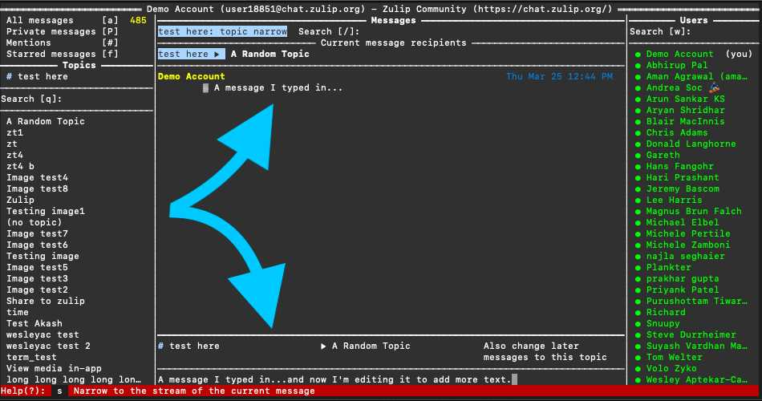

## Close Zulip Terminal

To exit out of the Zulip Terminal app, type <kbd>ctrl</kbd><kbd>c</kbd>.

## What's Next?

That's all for today! If you have a community server account, you should use the web app to [subscribe](https://zulip.com/help/browse-and-subscribe-to-streams) to the **[#zulip-terminal](https://chat.zulip.org/#narrow/stream/206-zulip-terminal)** stream. Then you can use Zulip Terminal to say hi and chat in the **[#zulip-terminal](https://chat.zulip.org/#narrow/stream/206-zulip-terminal)** stream!

If you're looking for more things to try with Zulip Terminal, how about exploring our [FAQ](https://github.com/zulip/zulip-terminal/blob/main/docs/FAQ.md)? We explain more in-depth about how to [change your theme](https://github.com/zulip/zulip-terminal/blob/main/docs/FAQ.md#are-there-any-themes-available-other-than-the-default-one), [tell when messages are read](https://github.com/zulip/zulip-terminal/blob/main/docs/FAQ.md#when-are-messages-marked-as-having-been-read), and [access multiple servers](https://github.com/zulip/zulip-terminal/blob/main/docs/FAQ.md#how-do-i-access-multiple-servers).
